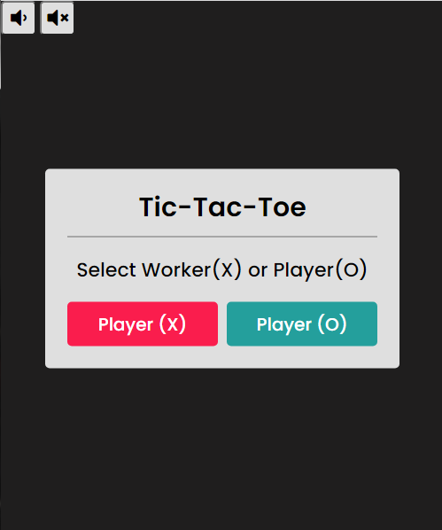
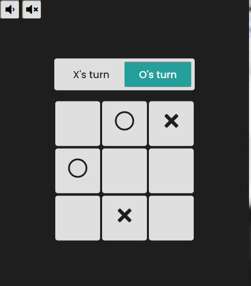

<h1 align="center">Squid Games Tic Tac Toe</h1>

  
   

<h2></h2>

The game is a practice code from CodingNepals tutorials. I used a lots of JavaSript making this and this learned a lot.

<h2>OverView of the Game</h2>
<li>Contains Sound Buttons for the Popular Squid-Games Doll Music</li>
<li>Option to choose between Players or Worker</li>
<li>Auto fill from the Second player</li>
<li>A display result pannel, Whether you lost, won or its a tie.</li>
